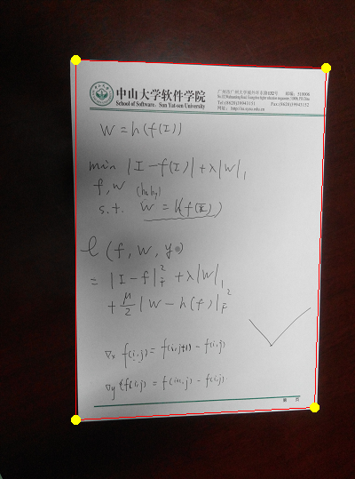
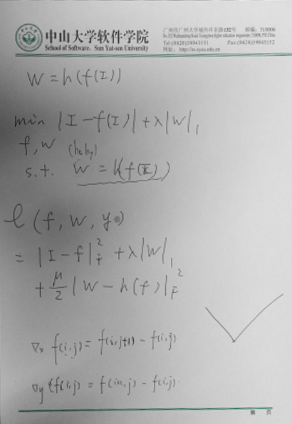

# [CVPR] A4 Paper Sheet Detection and Cropping with Hough Transform and Warping

Function similar to Document Scanner. Given images of A4 paper sheets, output paper sheets' four corners as well as four edges and their equations. Then crop the background and leave the paper sheet in proper position and standard scaling. We can do this in three steps. Firstly, detect edges with hough transform. Then store the corners in order. Lastly, applying a perspective transform to warp the image.

Images are available. Codes implemented with The CImg Library in C++ language. For more detail about the theory, implementation, results and improvement, please read [my post](https://hypjudy.github.io/2017/03/28/cvpr-A4-paper-sheet-detection-and-cropping/).

