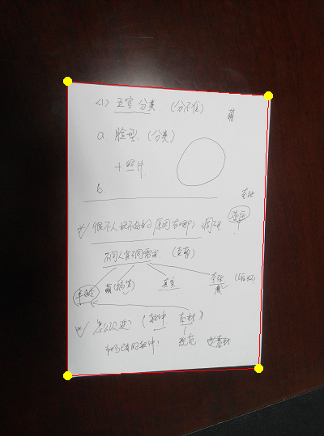

# [CVPR] Detect Edges and Corners of Paper Sheet with Hough Transform

Given images of A4 paper sheets, output paper sheets' four corners as well as four edges and their equations. The Hough transform is a feature extraction technique. The simplest case of Hough transform is detecting straight lines. Here we use it for paper sheet detection.

Images are available. Codes implemented with The CImg Library in C++ language. For more detail about the theory, implementation, results and improvement, please read [my post](https://hypjudy.github.io/2017/03/28/cvpr-detect-edges-of-paper-sheet-with-hough-transform/).

