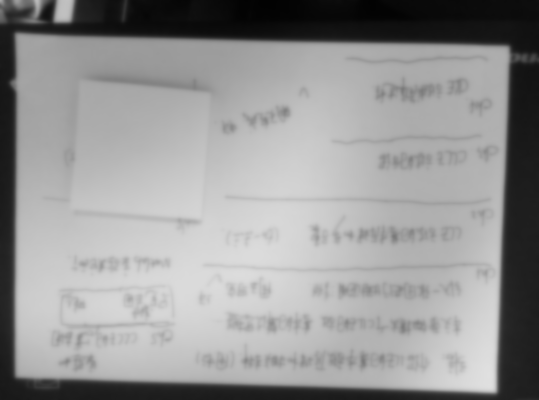
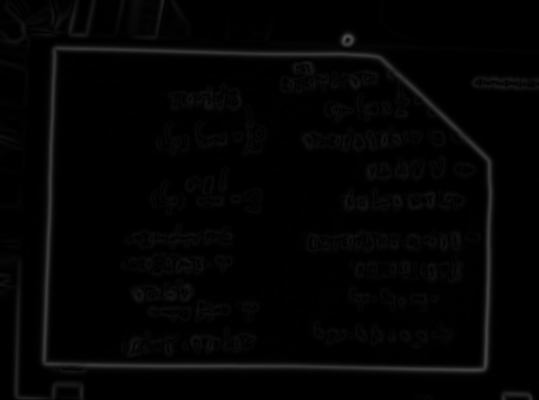
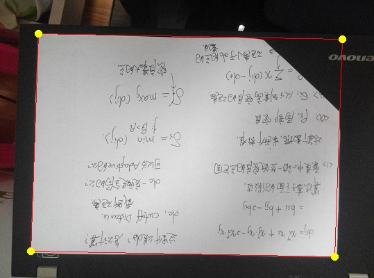
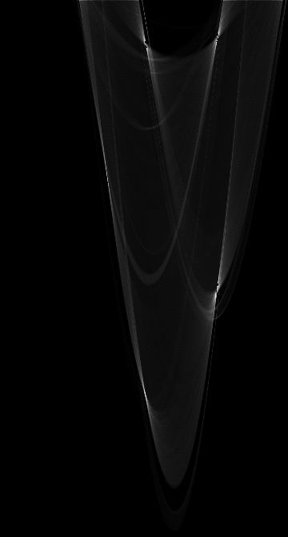
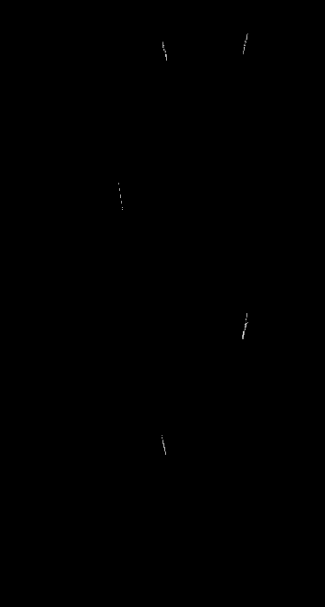
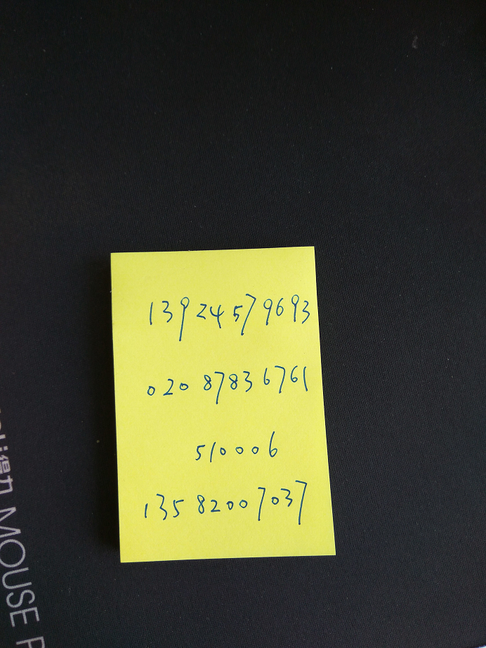
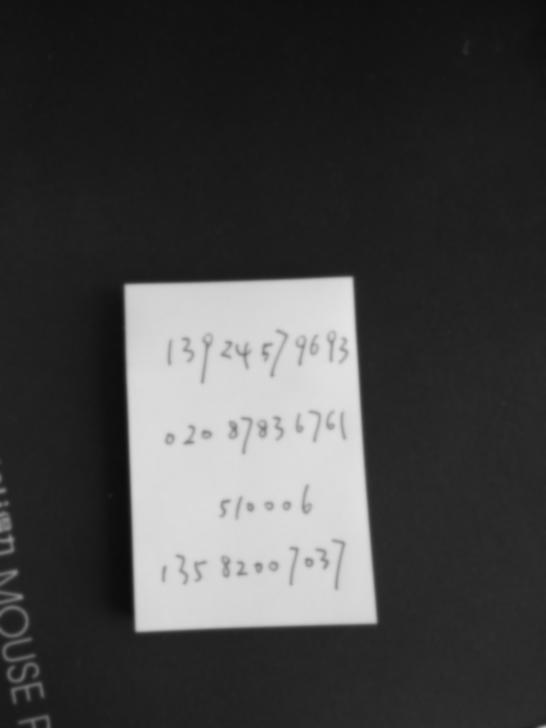
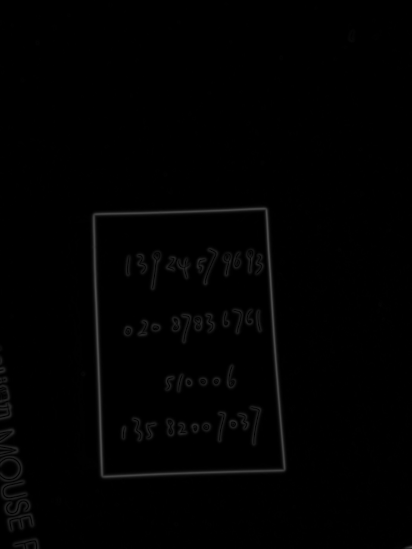
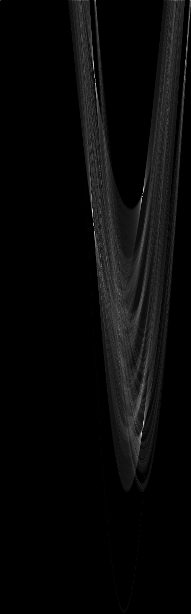
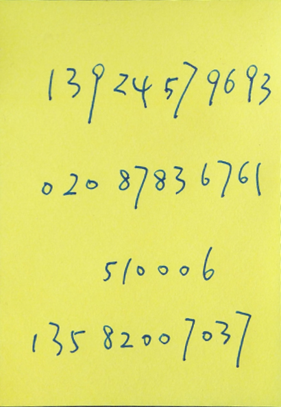

# A4 Paper Sheet Detection and Cropping
Function similar to Document Scanner. Given images of A4 paper sheets, output paper sheets' four corners as well as four edges and their equations. Then crop the background and leave the paper sheet in proper position and standard scaling. We can do this in three steps. Firstly, detect edges with hough transform. Then store the corners in order. Lastly, apply a perspective transform to warp the image.

For more details about the theory, implementation, results and improvement, please read [my post](https://hypjudy.github.io/2017/03/28/cvpr-A4-paper-sheet-detection-and-cropping/).

Any feedback is welcomed!

## Features
* Writing in C++ from scratch
* Default parameters apply to diverse datasets

## Related Project
[Handwritten Digits Recognition](https://github.com/HYPJUDY/handwritten-digits-recognition)

## Usage
### Dependencies
1. gcc >= 4.7 (Or VS2015)
2. [Eigen](http://eigen.tuxfamily.org/index.php?title=Main_Page) for matrix operations. Please download and configure yourself.
3. [The CImg Library](http://cimg.eu/) for image processing operations. (optional. already included in the repository)

I test on Visual Studio 2015, C++11. Here's the guide for [Using Eigen with Microsoft Visual Studio](http://eigen.tuxfamily.org/index.php?title=IDEs#Visual_Studio):
1. Download (e.g. [Eigen 3.3.3](http://bitbucket.org/eigen/eigen/get/3.3.3.zip)) and unpack in `EIGENDIR` (e.g. `F:\eigen3.3.3`)
2. Add `EIGENDIR` in VS Project(*Project->Properties->C/C++->General->Additional Include Directories->F:\eigen3.3.3;*)

### Run with my datasets
Simply download this repository, compile and run. Change the parameter `CASE` in `main.cpp` to choose different datasets.

Here I have two datasets prepared by Kun Zeng for test. (All results also have been generated in corresponding folders)
* `dataset1`: 16 A4 paper sheets with diverse contents. Placed with different angles and in different background. Some of them are lack of one corners. The resolution of each image is `400px*539px` or `539px*400px`.
* `dataset2`: 5 sticky notes or small paper sheets with digits. Placed with different angles and in different background. The resolution of each image is `922px*692px` or `692px*922px`.

### Run with your datasets
1. Take photos of paper sheets.
2. (Optional) Scale images to proper size (e.g. `400px~700px` for smaller side). The default parameters should works well for proper size.
3. Images should be of `bmp` format (e.g. convert by [ImageMagick](https://www.imagemagick.org/script/index.php))
4. Put your images in a folder and modify the parameters in `main.cpp`.
5. Compile and run the program.
6. (Optional) If the program exit with error (-1, -2 or -3), please check the `Error cases guide` in the end of `main.cpp` and tune the parameters in `Hough.cpp`.

### Utils
By default, the results `*_marked.bmp` (marked with paper corners and edges) and `*_A4.bmp` (cropped paper sheet in A4 paper size) of each images will be saved in the same folder of the test dataset. The intermediate results of `blur`, `gradients` and `hough_space` will be displayed but not saved. You can set this in constructor `Hough::Hough()` of `Hough.cpp`.

## Results
Here I take two examples from two datasets. The intermediate process is shown.
### Dataset1
NO.14 image (scale by 45%)

      

### Dataset2
NO.4 image (scale by 40%)

      

